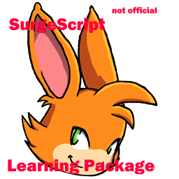

# SurgeScript-Learning-Package


[](https://travis-ci.org/zold-io/zold)

**The SurgeScript Not Official Learning Package** is a [learning package](https://en.wikipedia.org/wiki/Educational_software)
made for make more easier for people to make retro games based on [Open Surge](https://opensurge2d.org/), 
and also can be used to make normal projects with programming. If you want to 
support this project, try sending a pull request.

Credits for Alexandre Martins for making the language itself.

First, you must download it. You can do that by running this command:
```
$ git clone https://github.com/SDKTools/SurgeScript-Learning-Package
```

For Linux users things get a little bit more complicated.

1- Compile [SurgeScript](https://github.com/alemart/surgescript) manually

2- Install [PowerShell](https://learn.microsoft.com/en-us/powershell/scripting/install/installing-powershell-on-linux?view=powershell-7.4) on Linux

3- Put surgescript and it's libraries into the surgescript folder.

4- Rename the surgescript executable to surgescript.exe, and check if the 
program can be executed.

Now that you have installed everything, go to the "concepts" folder and do the lessons.

# Use Cases
## Practicing
If you are already familiar with programming, you can practice using this Learning Package!
## Learning
If you don't know programming, you can learn it! This Learning Package also helps with this!
## Teaching
This Learning Package can be used as material for teacher to teach to people who are learning

# How to Contribute

Create a new concept which is folder on the "concepts" folder.
Examples:

1- if else, 2- classes, 3- pointers.

Or if you want to create lessons, do this:

1- Create a folder in the concept you choosed and call this folder "lesson-\<lesson-name>".

2- Make the files INSTRUCTIONS.md to tell the instructions, script.ss to be the script, test.ss(optional) to be the test script, test.bat/test.ps1 to be the command to test the script.